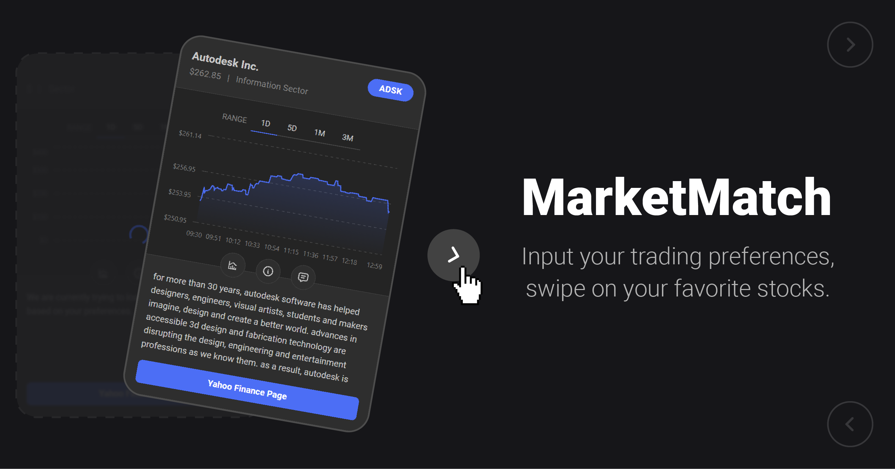

### Hey, I'm Alex! 

I'm a computer science student at the Georgia Institute of Technology in Atlanta, Georgia. I specialize in frontend development using React and Typescript. Having worked across the entire stack, from UI design to backend development, I'm deeply product-driven and focused on delivering the best user experience possible.

#### Check out some of my projects:

<!--
**AlexT101/AlexT101** is a ✨ _special_ ✨ repository because its `README.md` (this file) appears on your GitHub profile.

Here are some ideas to get you started:

- 🔭 I’m currently working on ...
- 🌱 I’m currently learning ...
- 👯 I’m looking to collaborate on ...
- 🤔 I’m looking for help with ...
- 💬 Ask me about ...
- 📫 How to reach me: ...
- 😄 Pronouns: ...
- ⚡ Fun fact: ...
-->
